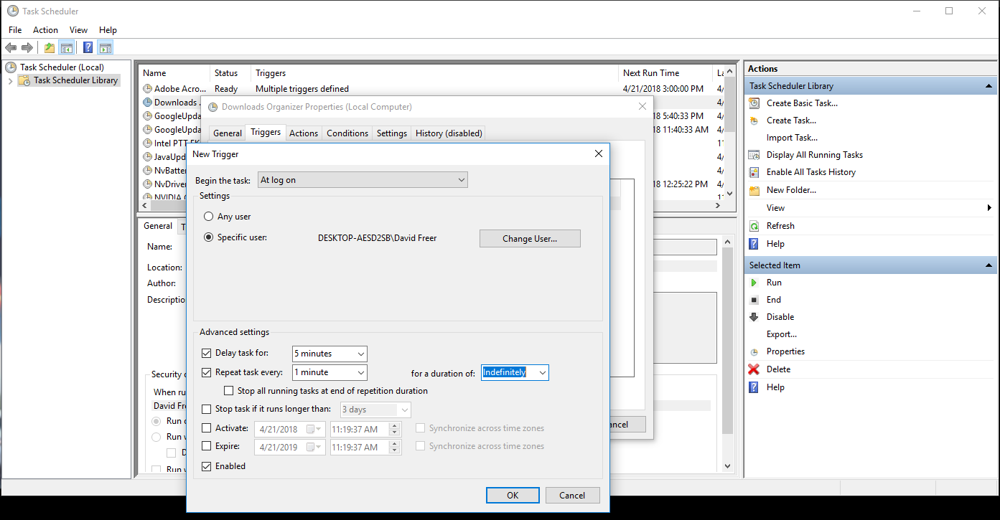
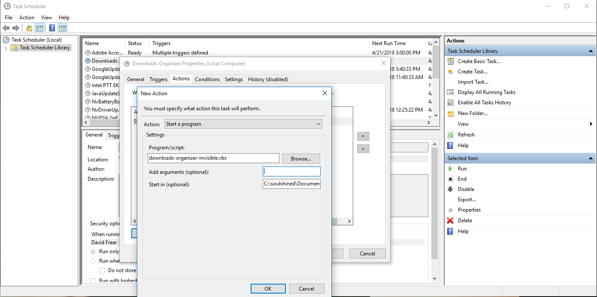

# Downloads Organizer
This script helps de-clutter your Downloads folder (or really any folder you specify) by grouping related file types to a specified sub directory.

For example, assuming 'Downloads' is your parent folder, you want to group all images in that folder into a 'Photos' folder, this script assumes the file structure is 'C:\User\Downloads\Photos\'. If that sub directory 'Photos' does not exist in the Downloads folder it will generate it at run-time. 

It is recommended to create a Task Scheduler task to run this automatically at your discretion. [Tutorial below](#automate). Or if your comfortable with the sytax, a simple timed loop and adding the script to your startup folder would suffice.

The included invisible.vbs script simply runs the script without populating a console window as to not distrupt your workflow

## Usage

Getting started to configure your file structure is really easy. Simply type the name of the Folder you want the grouped items to go in each 'SUBDIR' variable. First you need to specify the parent folder that will be monitored.

Simply change the following line in the script to the directory of your choice:

```batch
...
SET DIR_PATH="D:\Your User Name\Downloads"
...
```

Then specify your sub folders.

If you leave the 'SUBDIR' variables empty with quotation marks, files of that type will not be considered for moving, regardless if there is anything in the filter variable or not.

```batch
SET OFFICE_SUBDIR=""
SET OFFICE_FILTER="*.doc *.docx *.xls"
```
Files of a specified type will only be moved when the 'To Directory' (SUBDIR variable) is specified:

```batch
SET OFFICE_SUBDIR="Office"
SET OFFICE_FILTER="*.doc *.docx *.xls"
```

##### File Filters:

Files should be filtered as exemplified above. Multiple types can be included in the variable when seperated by a space. It's important to follow the structure above for casual users: ```*.extn``` &lt;asterik&gt; &lt;period&gt; &lt;extension name> otherwise unexpected results could occur. I have included the most common types of file extensions for each category already.

## Automate

To create a scheduled task, navigate to your systems Task Scheduler. <br>
For Windows 10: Keyboard Shortcut press <kbd> Win </kbd> + <kbd> S </kbd> and simply type task scheduler

- Click on 'Create Task...'

The 'General', 'Condition', 'Settings' tabs are personal perference. 

- Click on the 'Triggers' tab
  - Click on 'New...' (This is where you specify how often you want to run this script, you can type in the interval box, you dont have to select a predetermined length)

I personally repeat mine every 1 minute. You can even do 5 seconds if you want, its arbitrary.



- Click on the 'Actions' tab
  - Click on 'New...'
  - Action: Start A Program
  - Program/Script box: Type in 'downloads-organizer-invisible.vbs'
  - Start in (optional): Place the directory where you moved the 'downloads-organizer-invisible.vbs' to. This can be anywhere you wish. Simply type the parent directory's full path. For example: If you downloaded this repo and moved the files to your Documents folder. Type C:\Your User Name\Documents\
  - Click 'OK'



- Personalize any of the other settings as you wish. Next time you restart your computer this script will run automatically, and repeat at the interval you specified
